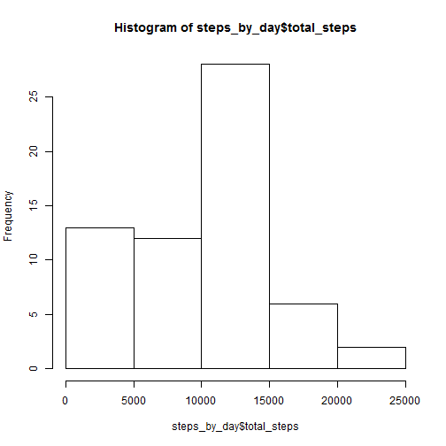
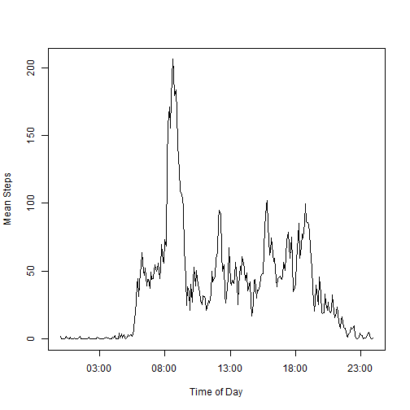
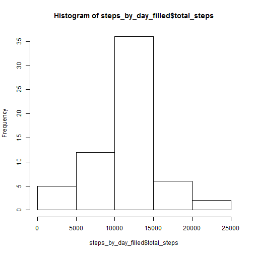
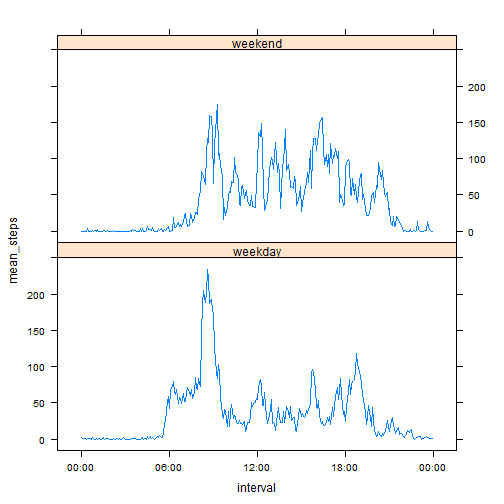

## Loading and preprocessing the data

### 1. Load the data
First, we load the data into a data.frame

```r
# load activity data
activity <- read.csv('activity.csv')
head(activity)
```

```
##   steps       date interval
## 1    NA 2012-10-01        0
## 2    NA 2012-10-01        5
## 3    NA 2012-10-01       10
## 4    NA 2012-10-01       15
## 5    NA 2012-10-01       20
## 6    NA 2012-10-01       25
```


### 2. Process/transform data to make it more usable 

Then we move it into a *table data frame* to use **dplyr** to handle data

```r
# use dplyr to process data
ta <- tbl_df(activity) %>%
  mutate(
    # parse dates
    date=ymd(date),
    # parse times    
    interval=as.POSIXct(strptime(sprintf("%04d",interval),format="%H%M")),
    timeofday=strftime(interval,"%H:%M")
 ) %>%
  print
```

```
## Source: local data frame [17,568 x 4]
## 
##    steps       date            interval timeofday
## 1     NA 2012-10-01 2015-01-12 00:00:00     00:00
## 2     NA 2012-10-01 2015-01-12 00:05:00     00:05
## 3     NA 2012-10-01 2015-01-12 00:10:00     00:10
## 4     NA 2012-10-01 2015-01-12 00:15:00     00:15
## 5     NA 2012-10-01 2015-01-12 00:20:00     00:20
## 6     NA 2012-10-01 2015-01-12 00:25:00     00:25
## 7     NA 2012-10-01 2015-01-12 00:30:00     00:30
## 8     NA 2012-10-01 2015-01-12 00:35:00     00:35
## 9     NA 2012-10-01 2015-01-12 00:40:00     00:40
## 10    NA 2012-10-01 2015-01-12 00:45:00     00:45
## ..   ...        ...                 ...       ...
```

## What is mean total number of steps taken per day?

### 1. Histogram of total number of daily steps

First, let's summarize the steps by day

```r
steps_by_day <- ta %>% 
  select(date,steps) %>%
  group_by(date) %>%
  summarize(total_steps=sum(steps,na.rm=T)) %>%
  print  
```

```
## Source: local data frame [61 x 2]
## 
##          date total_steps
## 1  2012-10-01           0
## 2  2012-10-02         126
## 3  2012-10-03       11352
## 4  2012-10-04       12116
## 5  2012-10-05       13294
## 6  2012-10-06       15420
## 7  2012-10-07       11015
## 8  2012-10-08           0
## 9  2012-10-09       12811
## 10 2012-10-10        9900
## ..        ...         ...
```
Now, we can plot a nice histogram

```r
hist(steps_by_day$total_steps)
```

 

### 2. Calculate mean and median values

And report **mean** and **median** values

```r
mean(steps_by_day$total_steps)
```

```
## [1] 9354.23
```

```r
median(steps_by_day$total_steps)
```

```
## [1] 10395
```

## What is the average daily activity pattern?

### 1. Time series plot of average number of steps across time intervals

Again, the first step is to summarize the steps by interval (we also include the timeofday column that contains the interval nicely formatted as a HH:MM string)

```r
steps_by_interval <- ta %>%
  group_by(interval,timeofday) %>%
  summarize(mean_steps=mean(steps,na.rm=T)) %>%
  print
```

```
## Source: local data frame [288 x 3]
## Groups: interval
## 
##               interval timeofday mean_steps
## 1  2015-01-12 00:00:00     00:00  1.7169811
## 2  2015-01-12 00:05:00     00:05  0.3396226
## 3  2015-01-12 00:10:00     00:10  0.1320755
## 4  2015-01-12 00:15:00     00:15  0.1509434
## 5  2015-01-12 00:20:00     00:20  0.0754717
## 6  2015-01-12 00:25:00     00:25  2.0943396
## 7  2015-01-12 00:30:00     00:30  0.5283019
## 8  2015-01-12 00:35:00     00:35  0.8679245
## 9  2015-01-12 00:40:00     00:40  0.0000000
## 10 2015-01-12 00:45:00     00:45  1.4716981
## ..                 ...       ...        ...
```


```r
plot(steps_by_interval$interval, steps_by_interval$mean_steps,type='l',ylab="Mean Steps", xlab="Time of Day")
```

 

### 2. Identify the 5 min interval that averages the max number of steps

Using the `which.max()` function we identify the interval (time of day) that has the largest mean number of steps. Note that we show the time of day in HH:MM format instead of the raw HHMM format that the unprocessed data returns

```r
steps_by_interval[which.max(steps_by_interval$mean_steps),c('timeofday','mean_steps')]
```

```
## Source: local data frame [1 x 2]
## 
##   timeofday mean_steps
## 1     08:35   206.1698
```

## Imputing missing values

### 1. How many NAs are there in steps column?


```r
sum(is.na(activity$steps))
```

```
## [1] 2304
```

### 2. Filling the missing values

We will replace the NAs with the average count of steps for the same interval across everyday

### 3. Create a filled dataset


```r
ta_filled <- ta %>%
  left_join(steps_by_interval) %>%
  mutate(steps=ifelse(is.na(steps),mean_steps,steps)) %>%
  select(date,interval,timeofday,steps) %>%
  print
```

```
## Joining by: c("interval", "timeofday")
```

```
## Source: local data frame [17,568 x 4]
## 
##          date            interval timeofday     steps
## 1  2012-10-01 2015-01-12 00:00:00     00:00 1.7169811
## 2  2012-10-01 2015-01-12 00:05:00     00:05 0.3396226
## 3  2012-10-01 2015-01-12 00:10:00     00:10 0.1320755
## 4  2012-10-01 2015-01-12 00:15:00     00:15 0.1509434
## 5  2012-10-01 2015-01-12 00:20:00     00:20 0.0754717
## 6  2012-10-01 2015-01-12 00:25:00     00:25 2.0943396
## 7  2012-10-01 2015-01-12 00:30:00     00:30 0.5283019
## 8  2012-10-01 2015-01-12 00:35:00     00:35 0.8679245
## 9  2012-10-01 2015-01-12 00:40:00     00:40 0.0000000
## 10 2012-10-01 2015-01-12 00:45:00     00:45 1.4716981
## ..        ...                 ...       ...       ...
```

### 4. Analyze the filled dataset

And now we analyze the resulting dataset

```r
steps_by_day_filled <- ta_filled %>% 
  select(date,steps) %>%
  group_by(date) %>%
  summarize(total_steps=sum(steps,na.rm=T)) %>%
  print  
```

```
## Source: local data frame [61 x 2]
## 
##          date total_steps
## 1  2012-10-01    10766.19
## 2  2012-10-02      126.00
## 3  2012-10-03    11352.00
## 4  2012-10-04    12116.00
## 5  2012-10-05    13294.00
## 6  2012-10-06    15420.00
## 7  2012-10-07    11015.00
## 8  2012-10-08    10766.19
## 9  2012-10-09    12811.00
## 10 2012-10-10     9900.00
## ..        ...         ...
```

Histogram:


```r
hist(steps_by_day_filled$total_steps)
```

 

And report **mean** and **median** values

```r
mean(steps_by_day_filled$total_steps)
```

```
## [1] 10766.19
```

```r
median(steps_by_day_filled$total_steps)
```

```
## [1] 10766.19
```

Obviously, when we replace NA values with the mean values across all days for the given interval, the total number of steps per day is increased, because now we are counting more steps that were not counted before.

## Are there differences in activity patterns between weekdays and weekends?

First, we create a new grouped dataset using weekdays and intervals as grouping criteria, and then plot the mean number of steps across weekdays and weekends using lattice system:


```r
# ensure weekdays are returned in english
Sys.setlocale(locale='C')
```

```
## [1] "C"
```

```r
steps_by_weekday_interval <- ta %>%
  mutate(weekday=as.factor(ifelse(
    weekdays(date) %in% c('Sunday','Saturday'), 
    "weekend",
    "weekday"))) %>%
  group_by(weekday,interval) %>%
  summarize(mean_steps=mean(steps,na.rm=T)) %>%  
  print
```

```
## Source: local data frame [576 x 3]
## Groups: weekday
## 
##    weekday            interval mean_steps
## 1  weekday 2015-01-12 00:00:00  2.3333333
## 2  weekday 2015-01-12 00:05:00  0.4615385
## 3  weekday 2015-01-12 00:10:00  0.1794872
## 4  weekday 2015-01-12 00:15:00  0.2051282
## 5  weekday 2015-01-12 00:20:00  0.1025641
## 6  weekday 2015-01-12 00:25:00  1.5128205
## 7  weekday 2015-01-12 00:30:00  0.7179487
## 8  weekday 2015-01-12 00:35:00  1.1794872
## 9  weekday 2015-01-12 00:40:00  0.0000000
## 10 weekday 2015-01-12 00:45:00  1.8461538
## ..     ...                 ...        ...
```

```r
xyplot(mean_steps ~ interval | weekday,
       data=steps_by_weekday_interval,
       type='l',
       layout=c(1,2),
       scales=list(format="%H:%M"))
```

 

**THE END**
